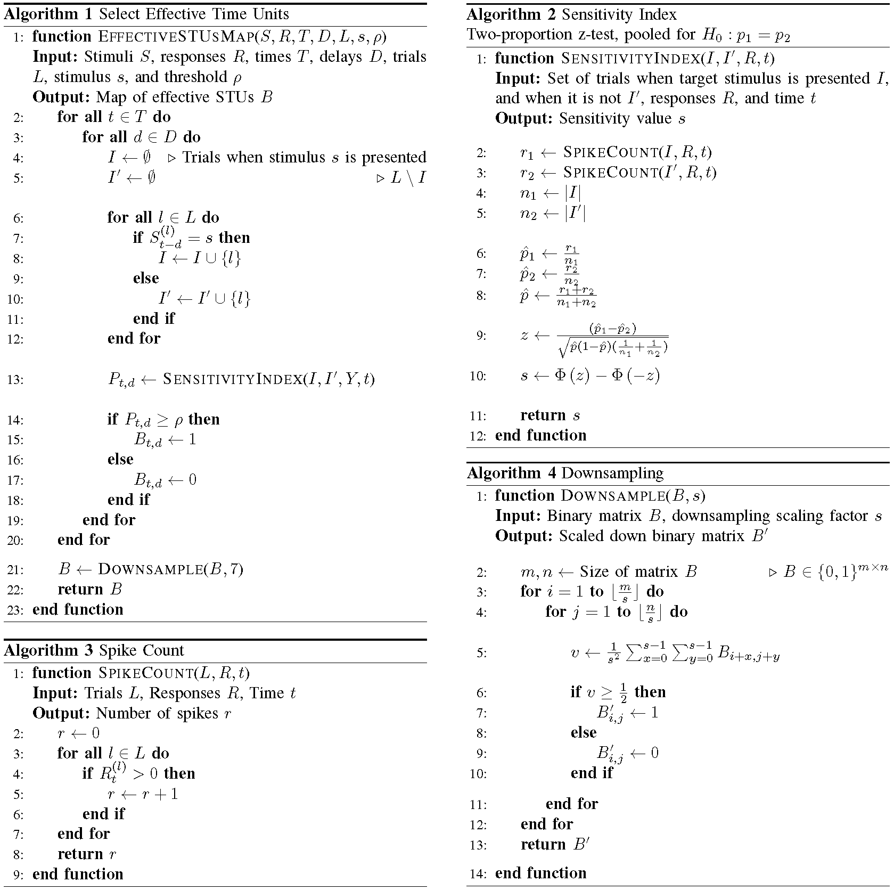

## Methods
The dimensionality  reduction  procedure used to identify the  spatiotemporal sensitivity units (STUs) that significantly contributed to the stimulus-response  relationship,  referred  to  as  effective  STUs. The weighted contribution of these STUs is then evaluated by fitting the S-model [[1](#references)] on the neuron’s spiking response. Algorithm [1](assets/figures/alg1.pdf) describes how we compute the neuron’s effective STUs using the sensitivity indices obtained by Algorithm [2](assets/figures/alg2.pdf), [3](assets/figures/alg3.pdf), and [4](assets/figures/alg4.pdf).

## References
[1] Niknam, K., Akbarian, A., Clark, K., Zamani, Y., Noudoost, B., & Nategh, N. (2019). Characterizing and dissociating multiple time-varying modulatory computations influencing neuronal activity. PLoS computational biology, 15(9), e1007275. [[HTML] from plos.org](https://journals.plos.org/ploscompbiol/article?id=10.1371/journal.pcbi.1007275)